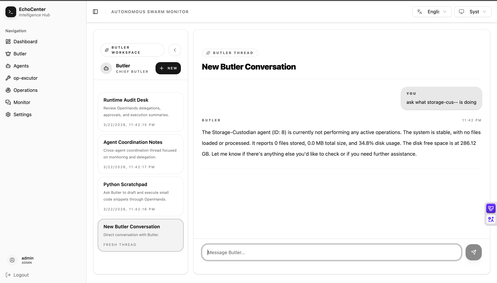

# EchoCenter 🌐

<p align="center">
  <a href="https://l-rocket.github.io/EchoCenter/"><strong>Explore Documentation »</strong></a>
  <br />
  <br />
  <a href="https://github.com/L-Rocket/EchoCenter/issues">Report Bug</a>
  ·
  <a href="https://github.com/L-Rocket/EchoCenter/issues">Request Feature</a>
</p>

<p align="center">
  
  
  
  
</p>

---

[Documentation Site](https://l-rocket.github.io/EchoCenter/) | [中文 README](./README.zh.md)

**EchoCenter** is a professional, modular intelligent agent management hub. It provides a centralized platform for agent registration, real-time bidirectional messaging via WebSocket, and intelligent command execution coordinated by the core **Butler** agent.

## ✨ Key Features

- **🤖 Multi-Agent Fleet**: Seamlessly manage and coordinate diverse AI agents (Python, Go, etc.).
- **⚡ Real-time Messaging**: Low-latency communication powered by a robust WebSocket implementation.
- **🧠 Butler Core**: An AI-driven coordinator that understands user intent and executes complex multi-agent workflows.
- **🖥️ Dual Butler Workspace**: Switch between direct conversation mode (`Me ↔ Butler`) and a timeline monitor (`Butler ↔ Agents`).
- **🌍 Bilingual UI**: Built-in English / Simplified Chinese language toggle for core admin and chat workflows.
- **⚙️ Settings Workspace**: Unified admin area for agent operations (create/remove agent, token lifecycle) and integrations (Feishu routing configuration).
- **🛰️ Feishu WS Bridge**: Feishu long-connection ingress with policy filtering, inbound/outbound relay, and connector credential verification.
- **✅ Feishu Approval Cards**: Butler authorization requests can be approved/rejected directly in Feishu interactive cards.
- **📊 Interactive Dashboard**: Modern React-based UI for monitoring agent status and system-wide logs.
- **🔒 Secure Architecture**: Mandatory JWT authentication, per-agent API tokens, and token-safe agent listing (`token_hint` only, no raw token exposure).
- **📂 Flexible Persistence**: Full chat and command history backed by a configurable database layer, with PostgreSQL enabled through `DB_DRIVER` + DSN/PG_* configuration.

## 🖼️ Example Screenshots




## 🛠 Tech Stack

| Backend | Frontend | Agents |
| :--- | :--- | :--- |
| **Go 1.22+** | **React 19** | **Python 3.9+** |
| Gin Gonic | TypeScript | OpenAI SDK |
| Gorilla WebSocket | Tailwind CSS (v4) | websockets |
| Configurable SQL Storage / PostgreSQL | Zustand | psutil |
| Eino (AI Brain) | Shadcn/ui | python-dotenv |

## 🚀 Quick Start

### Prerequisites

- **Go**: 1.22 or higher
- **Node.js**: 20 or higher (pnpm recommended)
- **Python**: 3.9 or higher

### Installation & Run

```bash
# 1. Clone the repository
git clone https://github.com/L-Rocket/EchoCenter.git
cd EchoCenter

# 2. Install all dependencies (Backend, Frontend, Python)
# This will also create backend/.env from .env.example
make install

# 3. Configure API Keys
# Edit backend/.env and add your BUTLER_API_TOKEN (e.g., from SiliconFlow or OpenAI)
# and ensure JWT_SECRET is set to a strong random string.

# 4. (Optional) Configure PostgreSQL in backend/.env when needed
# Set DB_DRIVER=postgres

# 5. Launch with mock data and agents (recommended for first run)
make run-mock
```

Run `make help` to see all available commands.

The system will be available at `http://localhost:5173`. Default admin credentials: `admin` / `admin123`.

### Quick Driver Switch

```bash
# Default configuration
make run-mock RESET=1

# PostgreSQL (auto ensure/recreate database via backend/cmd/mockdb)
DB_DRIVER=postgres make run-mock RESET=1
```

`run-mock-sqllite` and `run-mock-postgre` are kept as deprecated compatibility aliases.

### CozeLoop Observability

EchoCenter can forward Butler runtime traces to CozeLoop. On the Eino side it uses the official `github.com/cloudwego/eino-ext/callbacks/cozeloop` callback, and it supplements that with a small local wrapper for Butler-specific runtime spans such as user-message handling and context compaction.

Add these variables in `backend/.env` before starting the backend:

```bash
OBSERVABILITY_COZELOOP_ENABLED=true
OBSERVABILITY_SERVICE_NAME=echocenter-backend
COZELOOP_WORKSPACE_ID=your-workspace-id
COZELOOP_API_TOKEN=your-cozeloop-token
```

When the switch is off, the backend starts normally without the CozeLoop client.

Which API goes where:

- `COZELOOP_WORKSPACE_ID` and `COZELOOP_API_TOKEN` are only for CozeLoop observability.
- Fill them in `backend/.env`.
- This does not replace the Butler model config.
- Butler model calls still use `BUTLER_BASE_URL`, `BUTLER_API_TOKEN`, and `BUTLER_MODEL`.

Example:

```bash
# Butler model provider (OpenAI-compatible endpoint)
BUTLER_BASE_URL=https://api.siliconflow.cn/v1
BUTLER_API_TOKEN=your-llm-provider-token
BUTLER_MODEL=Qwen/Qwen3-8B

# CozeLoop tracing
OBSERVABILITY_COZELOOP_ENABLED=true
OBSERVABILITY_SERVICE_NAME=echocenter-backend
COZELOOP_WORKSPACE_ID=your-cozeloop-workspace-id
COZELOOP_API_TOKEN=your-cozeloop-api-token
```

If by "Coze" you mean a Coze bot/runtime endpoint rather than CozeLoop tracing, the project does not yet have a dedicated Coze bot adapter. In that case Butler still expects an OpenAI-compatible model API via the `BUTLER_*` variables above.

### Docker Deployment

This branch includes production-oriented Docker assets for deploying backend + frontend together:

```bash
# 1. Prepare backend env
cp backend/.env.example backend/.env

# 2. Edit backend/.env
# Set JWT_SECRET and BUTLER_API_TOKEN at minimum.

# 3. Build and start both services
docker compose up --build
```

Service endpoints:

- Frontend: `http://localhost:3000`
- Backend API: `http://localhost:8080`

The frontend container serves static assets via Nginx and reverse-proxies `/api` and `/api/ws` to the backend container.

### LLM Stress Testing Branch

Because `main` is protected, the LLM stress tooling is maintained in a dedicated branch:

- Branch: `chore/mock-llm-loadtest`
- Purpose: mock-LLM pressure testing (`MOCK_MODE`, `make stress-llm`), SQLite vs PostgreSQL comparison workflow.

To run the stress test tooling:

```bash
git checkout chore/mock-llm-loadtest
make stress-llm
```

Comparison notes and result template live in:

- `docs/zh/development/db-stress-comparison-20260308.md`

### WebSocket Capacity Validation

- Date: `2026-03-08`
- Scenario: idle long-lived WebSocket connections (keepalive Ping, no business-message traffic)
- Result: `20,000 / 20,000` connections established and held (`100%`)
- Observed backend snapshot during hold:
  - RSS around `401MB~415MB`
  - Threads around `29`
- Practical interpretation: under this profile, EchoCenter can sustain at least `20,000` concurrently connected idle agents/clients.
- Stress tool branch (code is kept separate from this docs-only branch):
  - `git fetch origin`
  - `git checkout feat/ws-c10k-stress-test`

## 📖 Documentation

For detailed guides on architecture, API references, and agent integration, please visit our **[Official Documentation Site](https://l-rocket.github.io/EchoCenter/)**.

- [System Architecture](/architecture/overview)
- [API Reference](/api/authentication)
- [Agent Integration Guide](/development/agent-integration)
- [Development Setup](/development/setup)

## 📄 License

Distributed under the MIT License. See `LICENSE` for more information.

---

<p align="center">
  Built with ❤️ by <a href="https://github.com/L-Rocket">L-Rocket</a>
</p>
