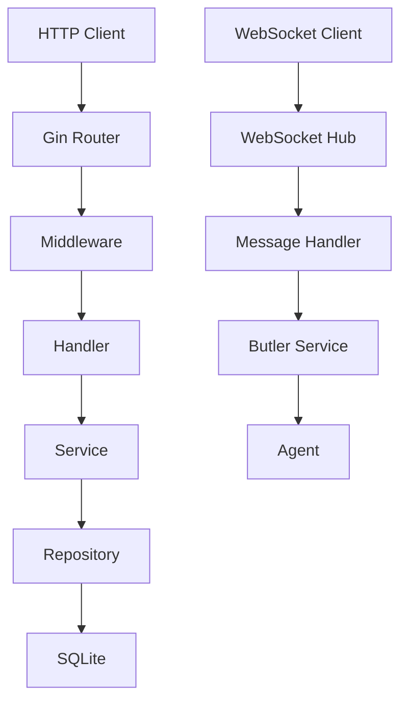

# Backend Architecture

## Overview

The backend service is the core of EchoCenter, responsible for handling HTTP requests, WebSocket communication, business logic, and data persistence.

## Project Structure

```
backend/
├── cmd/
│   └── server/
│       └── main.go          # Entry point
├── internal/
│   ├── api/                 # API layer
│   │   ├── handler/        # Handlers
│   │   ├── middleware/     # Middleware
│   │   ├── router/         # Routing
│   │   └── websocket/      # WebSocket
│   ├── auth/               # Authentication
│   ├── butler/             # Butler service
│   ├── config/             # Configuration
│   ├── models/             # Data models
│   └── repository/         # Data storage
├── pkg/                    # Public packages
│   └── errors/            # Error handling
└── scripts/               # Startup scripts
```

## Core Components

### 1. HTTP API Service

- **Routing** - RESTful API routing
- **Handlers** - Request processing logic
- **Middleware** - Authentication, logging, error handling
- **Response** - Unified response format

### 2. WebSocket Service

- **Hub** - Connection management. Ensures messages are completely persisted (assigned DB sequence IDs) before broadcasting.
- **Message Handler** - Message distribution. Runs persistence synchronously while delegating LLM processing asynchronously.
- **Agent Registration** - Agent connection management
- **Routing Rules** - `target_id` routing, controlled sender-echo for `CHAT*`, and admin-scoped Butler-Agent monitor events.

### 3. Authentication Service

- **JWT** - Token generation and validation
- **Middleware** - Route protection
- **User Management** - User CRUD

### 4. Butler Service

- **Message Processing** - Receiving and processing messages. Specifically ignores `AGENT` role messages to prevent infinite processing loops.
- **Command Execution** - Executing user commands
- **Authorization Request** - Sending authorization requests
- **Response Handling** - Processing agent responses

### 5. Data Storage

- **SQLite / PostgreSQL** - SQLite is default for local development, PostgreSQL can be enabled with `DB_DRIVER=postgres`.
- **Migrations** - Built-in migration system with a `migrations` tracking table to ensure atomic and reliable schema updates.
- **Repository** - Data access layer has been split into focused modules (users/messages/chat/butler auth/bootstrapping) to keep SQL boundaries clear.
- **Credential Stores** - Human and machine credentials are split into dedicated tables (`human_credentials`, `machine_credentials`) for clearer security boundaries.

## Architecture Diagram

:::demo

:::

## Data Models

### User

```go
type User struct {
    ID       uint   `json:"id"`
    Username string `json:"username"`
    Password string `json:"-"`
    Role     string `json:"role"`
}
```

### Message

```go
type Message struct {
    ID         int    `json:"id,omitempty"`
    LocalID    string `json:"local_id,omitempty"`
    SenderID   int    `json:"sender_id"`
    SenderName string `json:"sender_name"`
    SenderRole string `json:"sender_role"`
    TargetID   int    `json:"target_id,omitempty"`
    Payload    any    `json:"payload"`
    Timestamp  string `json:"timestamp,omitempty"`
}
```

### Agent

```go
type Agent struct {
    ID       uint   `json:"id"`
    Username string `json:"username"`
    Role     string `json:"role"`
    Status   string `json:"status"`
}
```

## API Routes

### Authentication

- `POST /api/auth/login` - Login
- `POST /api/auth/register` - Register

### Users

- `GET /api/users` - Get user list
- `GET /api/users/:id` - Get user details
- `POST /api/users/agents` - Register agent
- `DELETE /api/users/agents/:id` - Delete agent

### Messages

- `GET /api/messages` - Get message list
- `POST /api/messages` - Send message

## Middleware

### Auth Middleware

```go
func AuthMiddleware() gin.HandlerFunc {
    return func(c *gin.Context) {
        token := c.GetHeader("Authorization")
        // Validate token
    }
}
```

### Logger Middleware

```go
func LoggerMiddleware() gin.HandlerFunc {
    return func(c *gin.Context) {
        // Log request
    }
}
```

## Error Handling

### Unified Error Format

```json
{
  "error": "User friendly error message"
}
```

### Error Security

- **Information Hiding** - In production, internal errors (500) hide database details and return a generic "Internal server error" to the client.
- **Detailed Logging** - The actual error cause is logged on the server for debugging purposes.
- **Type Mapping** - Application-specific errors are automatically mapped to appropriate HTTP status codes.

## Performance Optimization

### Database Optimization

- **Connection Pool** - Optimized for WAL mode, allowing multiple concurrent readers while maintaining data integrity.
- **Atomic Migrations** - All database schema changes are executed within transactions to ensure consistency.
- **Index Optimization** - Critical columns (timestamps, IDs) are indexed for fast retrieval.

### Caching

- Redis (future)
- In-memory cache

### Concurrency

- Goroutines
- Channels

## Security

### Input Validation

- Struct validation
- Type validation

### SQL Injection Protection

- Parameterized queries
- ORM usage

### XSS Protection

- HTML escaping
- Input validation

### Credential and Stream Safety

- `/api/users/agents` never returns raw `api_token` (only `token_hint` metadata).
- Butler-Agent monitor WebSocket events are targeted to authorized recipients (admins), not globally broadcast.
- Sender echo for `CHAT` / `CHAT_STREAM` / `CHAT_STREAM_END` is disabled for system actors (`AGENT`, `BUTLER`) to avoid self-loop recursion.

## Deployment

### Build

```bash
go build -o bin/server ./cmd/server
```

### Run

```bash
./bin/server
```

### Docker

```dockerfile
FROM golang:1.21-alpine
WORKDIR /app
COPY . .
RUN go build -o server ./cmd/server
CMD ["./server"]
```
