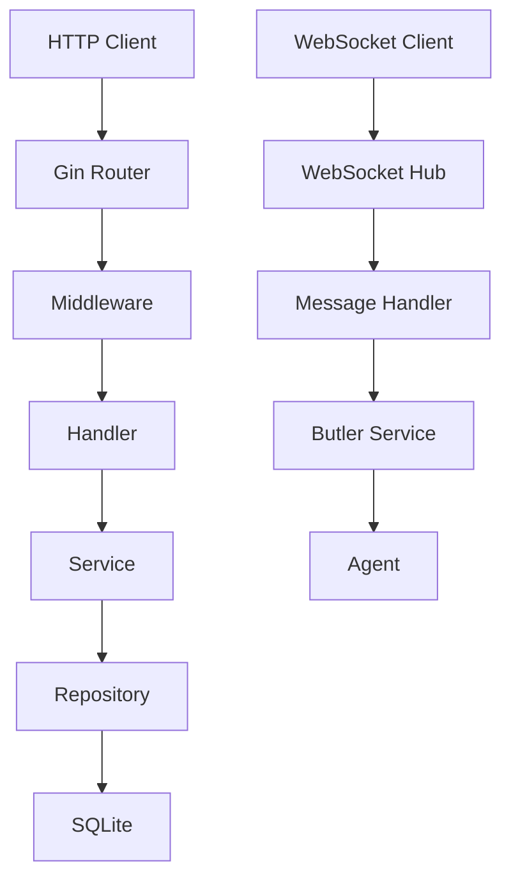

# Backend Architecture

## Overview

The backend service is the core of EchoCenter, responsible for handling HTTP requests, WebSocket communication, business logic, and data persistence.

## Project Structure

```
backend/
├── cmd/
│   └── server/
│       └── main.go          # Entry point
├── internal/
│   ├── api/                 # API layer
│   │   ├── handler/        # Handlers
│   │   ├── middleware/     # Middleware
│   │   ├── router/         # Routing
│   │   └── websocket/      # WebSocket
│   ├── auth/               # Authentication
│   ├── butler/             # Butler service
│   ├── config/             # Configuration
│   ├── models/             # Data models
│   └── repository/         # Data storage
├── pkg/                    # Public packages
│   └── errors/            # Error handling
└── scripts/               # Startup scripts
```

## Core Components

### 1. HTTP API Service

- **Routing** - RESTful API routing
- **Handlers** - Request processing logic
- **Middleware** - Authentication, logging, error handling
- **Response** - Unified response format

### 2. WebSocket Service

- **Hub** - Connection management
- **Message Handler** - Message distribution
- **Agent Registration** - Agent connection management
- **Message Broadcast** - Multicast messaging

### 3. Authentication Service

- **JWT** - Token generation and validation
- **Middleware** - Route protection
- **User Management** - User CRUD

### 4. Butler Service

- **Message Processing** - Receiving and processing messages
- **Command Execution** - Executing user commands
- **Authorization Request** - Sending authorization requests
- **Response Handling** - Processing agent responses

### 5. Data Storage

- **SQLite** - Local database
- **Repository** - Data access layer
- **Models** - Data model definitions

## Architecture Diagram

:::demo

:::

## Data Models

### User

```go
type User struct {
    ID       uint   `json:"id"`
    Username string `json:"username"`
    Password string `json:"-"`
    Role     string `json:"role"`
}
```

### Message

```go
type Message struct {
    ID         uint   `json:"id"`
    SenderID   uint   `json:"sender_id"`
    SenderName string `json:"sender_name"`
    SenderRole string `json:"sender_role"`
    TargetID   uint   `json:"target_id"`
    Payload    string `json:"payload"`
    Timestamp  string `json:"timestamp"`
}
```

### Agent

```go
type Agent struct {
    ID       uint   `json:"id"`
    Username string `json:"username"`
    Role     string `json:"role"`
    Status   string `json:"status"`
}
```

## API Routes

### Authentication

- `POST /api/auth/login` - Login
- `POST /api/auth/register` - Register

### Users

- `GET /api/users` - Get user list
- `GET /api/users/:id` - Get user details
- `POST /api/users/agents` - Register agent
- `DELETE /api/users/agents/:id` - Delete agent

### Messages

- `GET /api/messages` - Get message list
- `POST /api/messages` - Send message

## Middleware

### Auth Middleware

```go
func AuthMiddleware() gin.HandlerFunc {
    return func(c *gin.Context) {
        token := c.GetHeader("Authorization")
        // Validate token
    }
}
```

### Logger Middleware

```go
func LoggerMiddleware() gin.HandlerFunc {
    return func(c *gin.Context) {
        // Log request
    }
}
```

## Error Handling

### Unified Error Format

```json
{
  "error": {
    "code": "ERROR_CODE",
    "message": "Error message"
  }
}
```

### Error Codes

- `INVALID_CREDENTIALS` - Invalid credentials
- `UNAUTHORIZED` - Unauthorized
- `NOT_FOUND` - Not found
- `INTERNAL_ERROR` - Internal error

## Performance Optimization

### Database Optimization

- Connection pool
- Index optimization
- Query optimization

### Caching

- Redis (future)
- In-memory cache

### Concurrency

- Goroutines
- Channels

## Security

### Input Validation

- Struct validation
- Type validation

### SQL Injection Protection

- Parameterized queries
- ORM usage

### XSS Protection

- HTML escaping
- Input validation

## Deployment

### Build

```bash
go build -o bin/server ./cmd/server
```

### Run

```bash
./bin/server
```

### Docker

```dockerfile
FROM golang:1.21-alpine
WORKDIR /app
COPY . .
RUN go build -o server ./cmd/server
CMD ["./server"]
```
