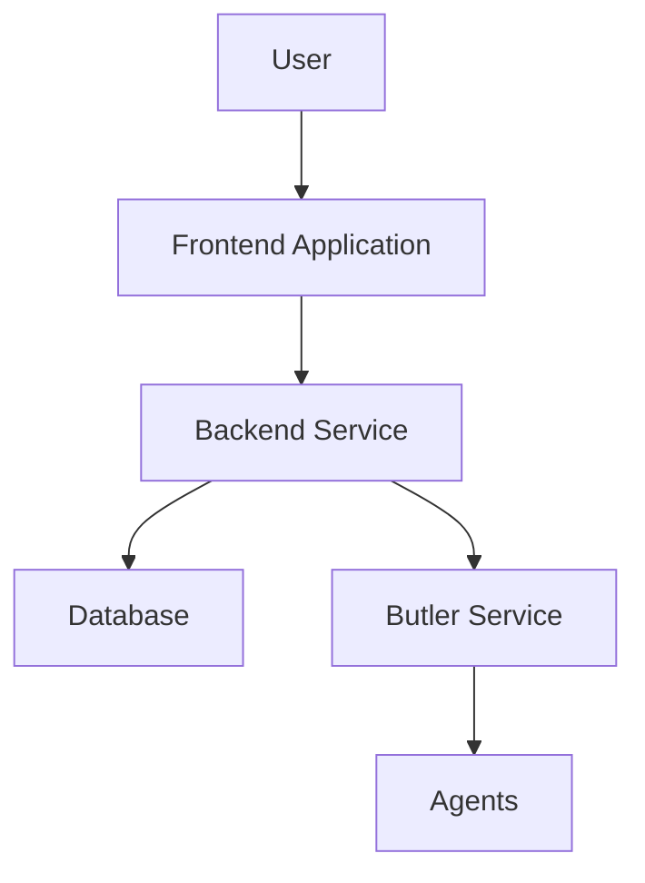

# System Architecture Overview

## Architecture Overview

EchoCenter adopts a layered architecture design, mainly consisting of the following components:

### Core Components

1. **Backend Service** (Go + Gin)
   - HTTP API service
   - WebSocket communication
   - Business logic processing

2. **Frontend Application** (React + TypeScript)
   - User interface
   - Real-time message display
   - State management

3. **Butler Service** (Go)
   - Core agent
   - Message processing
   - Command execution

4. **Agent Simulators** (Python)
   - Storage-Custodian
   - Other simulated agents

5. **Database** (SQLite / PostgreSQL)
   - User data
   - Chat history
   - System configuration

## Architecture Diagram

:::demo

:::

## Data Flow

### User Request Flow

```
User
  ↓
HTTP Request → Backend API → Handler → Business Logic → Database
  ↑
Response ←───────────────────────────────────────┘
```

### Real-time Communication Flow

```
User/Agent
  ↓
WebSocket Connection
  ↓
Hub (Message Distribution)
  ↓
Message Handler
  ↓
Butler Service
  ↓
AI Brain (Eino)
  ↓
Agents
```

## Tech Stack

### Backend
- **Go 1.22+** - Programming Language
- **Gin** - HTTP Framework
- **Gorilla WebSocket** - WebSocket implementation
- **SQLite / PostgreSQL** - Database
- **Eino** - AI Inference Engine

### Frontend
- **React 19** - UI Framework
- **TypeScript** - Type Safety
- **Tailwind CSS** - Styling Framework
- **Vite** - Build Tool

### Agents
- **Python 3.9+** - Programming Language
- **OpenAI SDK** - AI Interface
- **WebSockets** - Communication library

## Component Responsibilities

### Backend Service
- Provide REST API
- Manage WebSocket connections
- Handle user authentication
- Coordinate agent communication
- Data persistence

### Frontend Application
- User interface
- Real-time message display
- State management
- Agent monitoring

### Butler Service
- Core agent coordination
- Message processing
- Command execution
- Authorization requests

### Agent Simulator
- Simulate real agents
- Provide test data
- Verify system functionality

## Extensibility

### Adding New Agents
1. Create a new Python agent script
2. Implement WebSocket communication
3. Register in the database
4. Start the agent

### Adding New API Endpoints
1. Add a handler in `handler`
2. Add a route in `router`
3. Add middleware (if needed)
4. Test the endpoint

## Performance Considerations

- **Concurrency** - Use goroutines to handle concurrent requests
- **Connection Pool** - WebSocket connection pool management
- **Database Optimization** - Connection pool and index optimization
- **Caching** - Redis caching can be added in the future

## Security

- **JWT Authentication** - Token authentication
- **Password Hashing** - Bcrypt hashing
- **CORS Configuration** - Cross-origin protection
- **Input Validation** - Request validation
