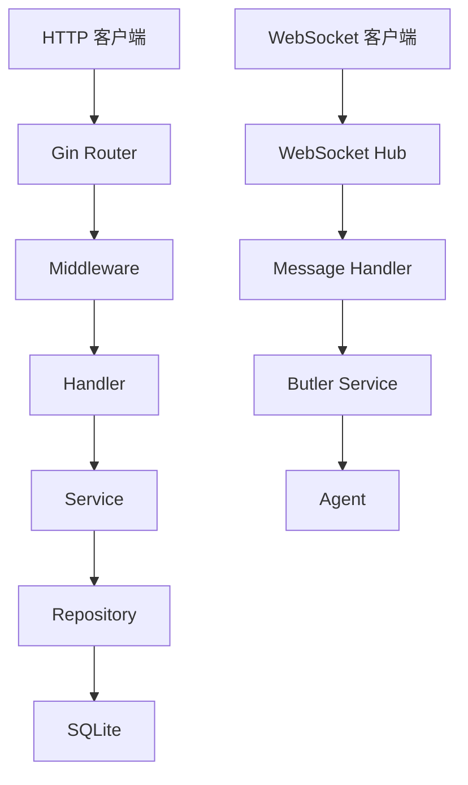

# 后端架构

## 概述

后端服务是 EchoCenter 的核心，负责处理 HTTP 请求、WebSocket 通信、业务逻辑和数据持久化。

## 项目结构

```
backend/
├── cmd/
│   └── server/
│       └── main.go          # 入口点
├── internal/
│   ├── api/                 # API 层
│   │   ├── handler/        # 处理器
│   │   ├── middleware/     # 中间件
│   │   ├── router/         # 路由
│   │   └── websocket/      # WebSocket
│   ├── auth/               # 认证
│   ├── butler/             # Butler 服务
│   ├── config/             # 配置
│   ├── models/             # 数据模型
│   └── repository/         # 数据存储
├── pkg/                    # 公共包
│   └── errors/            # 错误处理
└── scripts/               # 启动脚本
```

## 核心组件

### 1. HTTP API 服务

- **路由** - RESTful API 路由
- **处理器** - 请求处理逻辑
- **中间件** - 认证、日志、错误处理
- **响应** - 统一响应格式

### 2. WebSocket 服务

- **Hub** - 连接管理
- **消息处理器** - 消息分发
- **代理注册** - 代理连接管理
- **消息广播** - 多播消息

### 3. 认证服务

- **JWT** - 令牌生成和验证
- **中间件** - 路由保护
- **用户管理** - 用户 CRUD

### 4. Butler 服务

- **消息处理** - 接收和处理消息
- **命令执行** - 执行用户命令
- **授权请求** - 发送授权请求
- **响应处理** - 处理代理响应

### 5. 数据存储

- **SQLite** - 本地数据库，启用 WAL (Write-Ahead Logging) 模式以支持并发读写性能。
- **数据库迁移** - 内置迁移系统，使用 `migrations` 表追踪已执行的变更，确保 Schema 更新的原子性和可靠性。
- **Repository** - 数据访问层，将业务逻辑与 SQL 查询解耦。

## 架构图

:::demo

:::

## 数据模型

### User

```go
type User struct {
    ID       uint   `json:"id"`
    Username string `json:"username"`
    Password string `json:"-"`
    Role     string `json:"role"`
}
```

### Message

```go
type Message struct {
    ID         uint   `json:"id"`
    SenderID   uint   `json:"sender_id"`
    SenderName string `json:"sender_name"`
    SenderRole string `json:"sender_role"`
    TargetID   uint   `json:"target_id"`
    Payload    string `json:"payload"`
    Timestamp  string `json:"timestamp"`
}
```

### Agent

```go
type Agent struct {
    ID       uint   `json:"id"`
    Username string `json:"username"`
    Role     string `json:"role"`
    Status   string `json:"status"`
}
```

## API 路由

### 认证

- `POST /api/auth/login` - 登录
- `POST /api/auth/register` - 注册

### 用户

- `GET /api/users` - 获取用户列表
- `GET /api/users/:id` - 获取用户详情
- `POST /api/users/agents` - 注册代理
- `DELETE /api/users/agents/:id` - 删除代理

### 消息

- `GET /api/messages` - 获取消息列表
- `POST /api/messages` - 发送消息

## 中间件

### 认证中间件

```go
func AuthMiddleware() gin.HandlerFunc {
    return func(c *gin.Context) {
        token := c.GetHeader("Authorization")
        // 验证 token
    }
}
```

### 日志中间件

```go
func LoggerMiddleware() gin.HandlerFunc {
    return func(c *gin.Context) {
        // 记录请求日志
    }
}
```

## 错误处理

### 统一错误格式

```json
{
  "error": "用户友好的错误信息"
}
```

### 错误处理安全性

- **信息隐藏** - 在内部错误（500）发生时，系统会向客户端隐藏数据库等敏感细节，统一返回 "Internal server error"。
- **详细日志** - 真实的错误原因会记录在服务器日志中，便于调试。
- **类型映射** - 业务错误会自动映射到对应的 HTTP 状态码。

## 性能优化

### 数据库优化

- **连接池** - 针对 WAL 模式进行了优化，允许在保持数据一致性的同时进行多个并发读操作。
- **原子迁移** - 所有数据库结构变更都在事务中执行，确保一致性。
- **索引优化** - 对关键列（时间戳、ID）建立索引以实现快速检索。

### 缓存

- Redis（未来）
- 内存缓存

### 并发处理

- Goroutine
- Channel

## 安全性

### 输入验证

- 结构体验证
- 类型验证

### SQL 注入防护

- 参数化查询
- ORM 使用

### XSS 防护

- HTML 转义
- 输入验证

## 部署

### 构建

```bash
go build -o bin/server ./cmd/server
```

### 运行

```bash
./bin/server
```

### Docker

```dockerfile
FROM golang:1.21-alpine
WORKDIR /app
COPY . .
RUN go build -o server ./cmd/server
CMD ["./server"]
```
